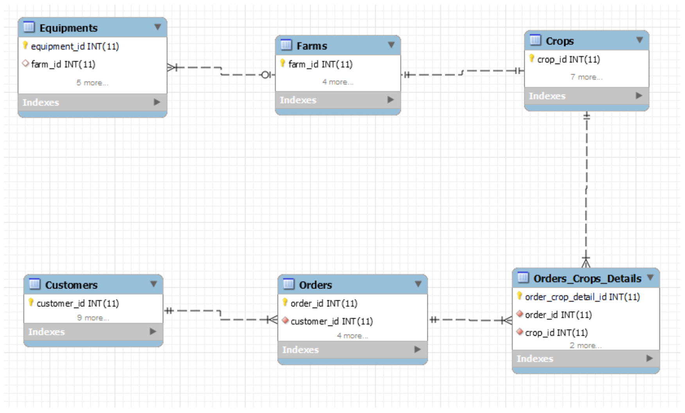
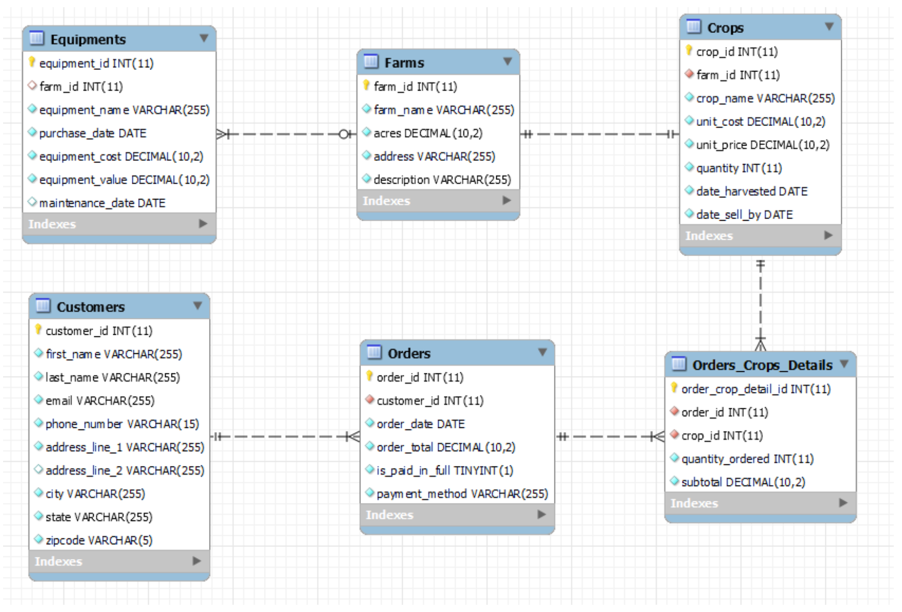

# Farm-Management-CRUD-App

## Overview

Jeremiah Clarksen, the world renown British car commentator turned farmer in the quaint
English countryside, sets focus of his next venture to the vast land of opportunities on the other side of the Atlantic known as the American Midwest. Confident from his successes garnered through hard work back home, he is determined to single-handedly capture the hearts and minds of American fans, only with a little help from his fellow distributors and a database-powered website that records pertinent information of his farms, equipment, crops, and gift shop orders and customers. The secret to his stateside success, which none other than himself or his distributors shall ever know, is that he will neither own a farm nor participate in the farming operation himself; instead, he will resell produce sourced from his subsidiary farms elsewhere in the nation and rebranded as his very own harvest. Despite locating himself in the sparsely populated middle of nowhere, Jeremiah expects to own and/or track at least 500 items for each entity and record $9 million in sales for the first fiscal year, all of which the system is perfectly capable of.

This project intends to be the one-stop-shop database manager for all prospective farmers yearning to keep track of their farms, equipment, crops, and every data related to sales of its products, such as customer and order information. The conception of this project is greatly attributed to our infatuation with a program widely popular in a major streaming platform, where a famous British car commentator suddenly decides to start a farm in the English countryside, and unsurprisingly faces a myriad of challenges. We wanted to help out any fellow farmers that may be facing similar problems; hence, the project was born.

## Database Outline

### Farms
<ul>
    <li>Description: The heart of the action, where the growing of all crops take place, grown and harvested all by Jeremiah... at least on appearance, that is. One farm will exclusively produce one crop, and each farm is maintained by one or many equipment. The database will manage a collection of such farms.</li>
    <li>Attributes:</li>
    <ul>
        <li>farm_id, PK, INT, auto_increment, not NULL</li>
        <li>farm_name, VARCHAR(255), not NULL</li>
        <li>acres, DECIMAL(10, 2), not NULL</li>
        <li>address, VARCHAR(255), not NULL</li>
        <li>description, VARCHAR(255), not NULL</li>
    </ul>

    <li>Relationships:</li>
    <ul>
        <li>1:1 with Crops. One farm will only grow one crop, and one crop can only
        be sourced from one farm.</li>
        <li>1:M with Equipments. One farm may be maintained by many equipment,
        but one equipment will solely be used by one farm.</li>
    </ul>
</ul>

### Equipments
<ul>
    <li>Description: Stores all kinds of equipment ranging from tractors to fertilizers. Any given equipment will only belong to one farm but many equipment may be used to maintain a single farm. Equipment cost and value fields are set to keep track of purchase price and the expected value in the event the equipment is no longer necessary and better off sold. An optional maintenance date field will store the next future date a necessary maintenance should take place.</li>
    <li>Attributes:</li>
    <ul>
        <li>equipment_id, PK, INT, auto_increment, not NULL</li>
        <li>farm_id, FK, INT, not NULL</li>
        <li>purchase_date, DATE, not NULL</li>
        <li>equipment_cost, DECIMAL(10, 2), not NULL</li>
        <li>equipment_value, DECIMAL(10, 2), not NULL</li>
        <li>maintenance_date, DATE</li>
    </ul>
    <li>Relationships:</li>
    <ul>
        <li>M:1 with Farms. Many equipment may be used to maintain one farm, but
        one equipment will only belong to one farm.</li>
    </ul>
</ul>

### Crops
<ul>
    <li>Description: The driver of growth for the enterprise and the sweet product that keeps bringing the customers back for more. For ease of operations, each crop is sourced from a single farm. This includes any sort of grains/vegetable that can conceivably be grown at a typical farm (including but not limited to corn, soybeans, wheat, potato, carrots, etc). Unit cost and price fields keep track of the best estimate cost to make one unit of crop and its potential selling price. Quantity is the amount harvested and available for sale. Date harvested field shows the date of harvest of a unit of crop for the customer’s benefit, whereas sell by date is set as dictated by relevant laws and regulations.</li>
    <li>Attributes:</li>
    <ul>
        <li>crop_id, PK, INT, auto_increment, not NULL</li>
        <li>farm_id, FK, INT, not NULL</li>
        <li>crop_name, VARCHAR(255), not NULL</li>
        <li>unit_cost, DECIMAL(10, 2), not NULL</li>
        <li>unit_price, DECIMAL(10, 2), not NULL</li>
        <li>quantity, INT, not NULL</li>
        <li>date_harvested, DATE, not NULL</li>
        <li>date_sell_by, DATE, not NULL</li>
    </ul>
        <li>Relationships:</li>
    <ul>
        <li>M:M with Orders, by way of Orders_Crops_Detail table. One or many
        crops can appear on one or many orders, and one or many orders may
        include one or many crops.</li>
        <li>1:1 with Farms. A single crop can only be sourced from a single farm, and
        a single farm only grows a single crop.</li>
    </ul>
</ul>

### Orders

<ul>
    <li>Description: The entity that keeps track of all orders made by customers. Each individual order includes the customer ID, date order is placed, total of order, status of order payment (whether paid or not), and payment method (cash, card, check, etc)... Details of any given order, such as how many of what crops were ordered, is kept track by the Order_Details joint table</li>
    <li>Attributes:</li>
    <ul>
        <li>order_id, PK, INT, auto_increment, not NULL</li>
        <li>customer_id, FK, INT, not NULL</li>
        <li>order_date, DATE, not NULL</li>
        <li>order_total, DECIMAL(10,2), not NULL</li>
        <li>is_paid_in_full, TINYINT(1), not NULL</li>
        <li>payment_method, VARCHAR(255), not NULL</li>
    </ul>
        <li>Relationships:</li>
    <ul>
        <li>M:M with Crops, by way of Orders_Crops_Detail table. One or many orders can include one or many crops, and one or many crops can be seen on one or many orders.</li>
        <li>1:M with Customers. A unique order only belongs to one customer, but one or many customer(s) may make as many orders as they wish.</li>
    </ul>
</ul>

### Customers

<ul>
    <li>Description: What good is a farm without its roadside shop and customers? Each customer will be asked, at the time of order, its full name, email address, phone number, and full address, so that the Farm can send promotional letters and random gifts, at the sole discretion of the owner.</li>
    <li>Attributes:</li>
    <ul>
        <li>customer_id, PK, INT, auto_increment, not NULL</li>
        <li>first_name, VARCHAR(255), not NULL</li>
        <li>last_name, VARCHAR(255), not NULL</li>
        <li>email, VARCHAR(255), not NULL</li>
        <li>phone_number, VARCHAR(15), not NULL</li>
        <li>address_line_1, VARCHAR(255), not NULL</li>
        <li>address_line_2, VARCHAR(255), not NULL</li>
        <li>city, VARCHAR(255), not NULL</li>
        <li>state, VARCHAR(255), not NULL</li>
        <li>zip_code, VARCHAR(5), not NULL</li>
    </ul>
        <li>Relationships:</li>
    <ul>
        <li>M:1 with Orders. One or many customers can place as many orders, but
        a single order will only belong to one customer.</li>   
    </ul>
</ul>

### Order_Crops_Details - Intersection Table

<ul>
    <li>A joint table to help keep track of the crop type and quantity of crop ordered in a given order. A single order may contain multiple counts of multiple crops, which is first kept track in this entity per crop, and then fed to the Order entity in aggregate. To illustrate, if a customer orders 5 bushels of corn and 3 pounds of wheat, there will be two order details: one for the corn, and another for the wheat, both sharing the same order ID.</li>
    <li>Attributes:</li>
    <ul>
        <li>order_crop_detail_id, PK, INT, not NULL, auto increment</li>
        <li>order_id, PK, FK1, INT, not NULL</li>
        <li>crop_id, PK, FK2, INT, not NULL</li>
        <li>quantity_ordered, INT, not NULL</li>
        <li>subtotal, DECIMAL(10,2), not NULL</li>
    </ul>
        <li>Relationships:</li>
    <ul>
        <li>1:M with Crops. A single order detail must contain one crop, and one crop
        can show up on one or many order details.li> 
        <li>M:1 with Orders. A single order detail will only belong to one order, but an
        order may contain at least one or many order details.</li>  
    </ul>
</ul>

## Entity Relationship Diagram (ERD)

## Schema Diagram

